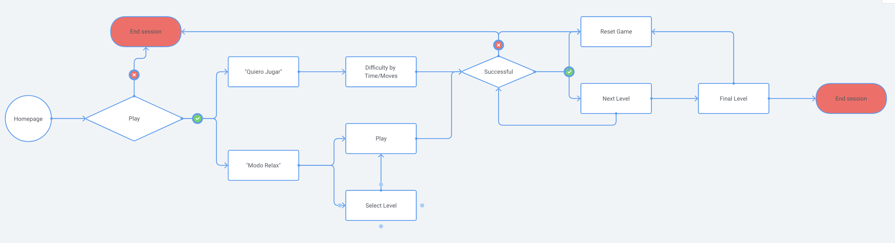

# Live Website:  https://memory-webdev.netlify.app/

 

# About this Project:

 This is a project I did following a Javascript Course on Domestika. It's a single-page application. All screen changes are made in Javascript. After the Bootcamp I attended, I came back to this game to adapt it to my new career and made some changes to convert it to a Memory Game with theme "Web Development" :)

 

- 2 Play Modus: Normal / Relax
- Normal mode: Time and Moves are limited 
- Relax mode: Level selection in Relax Mode
- Random card distribution each time

 
  
  
 
 ## Stack used:
 

 
 
 

## User Flowchart:

 
 
 

## Snapshots:

  

   

  

   

  

   

